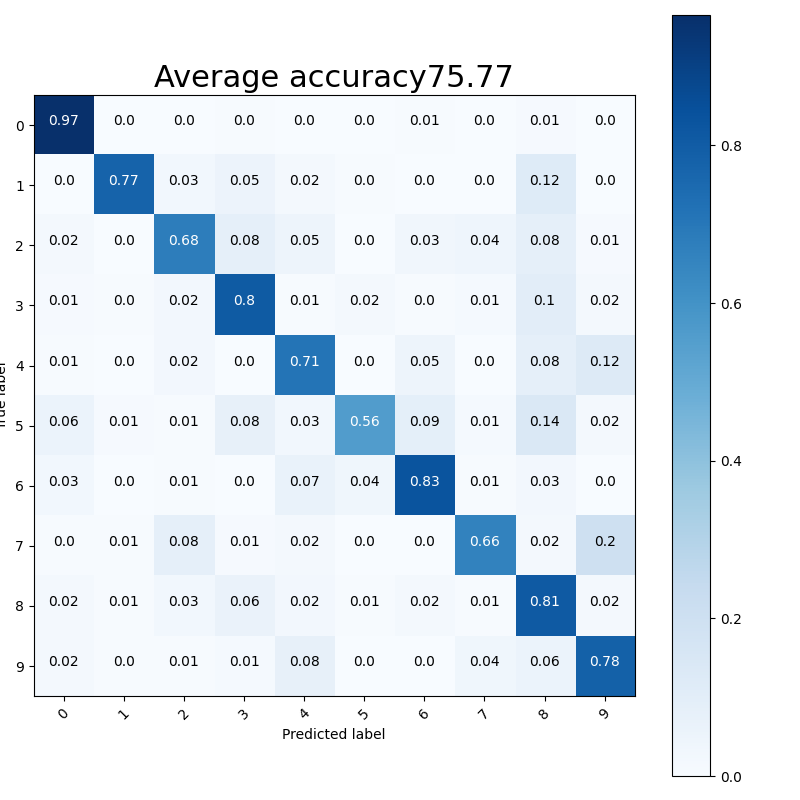
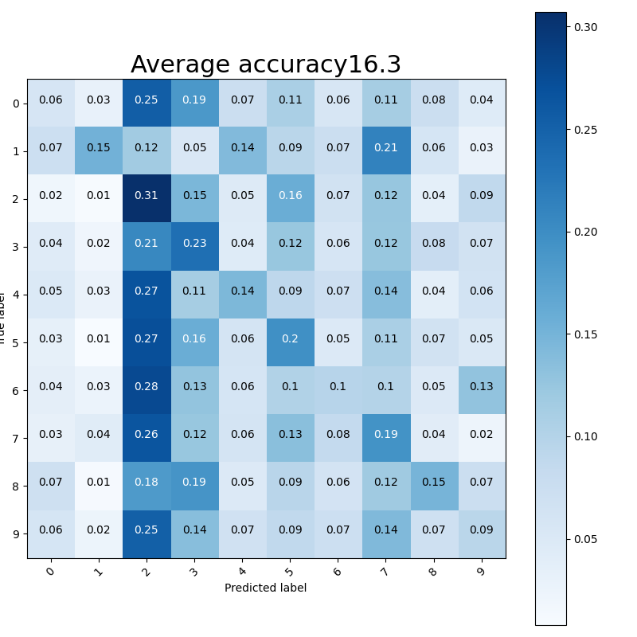
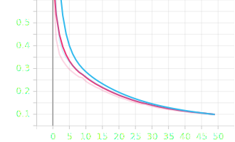
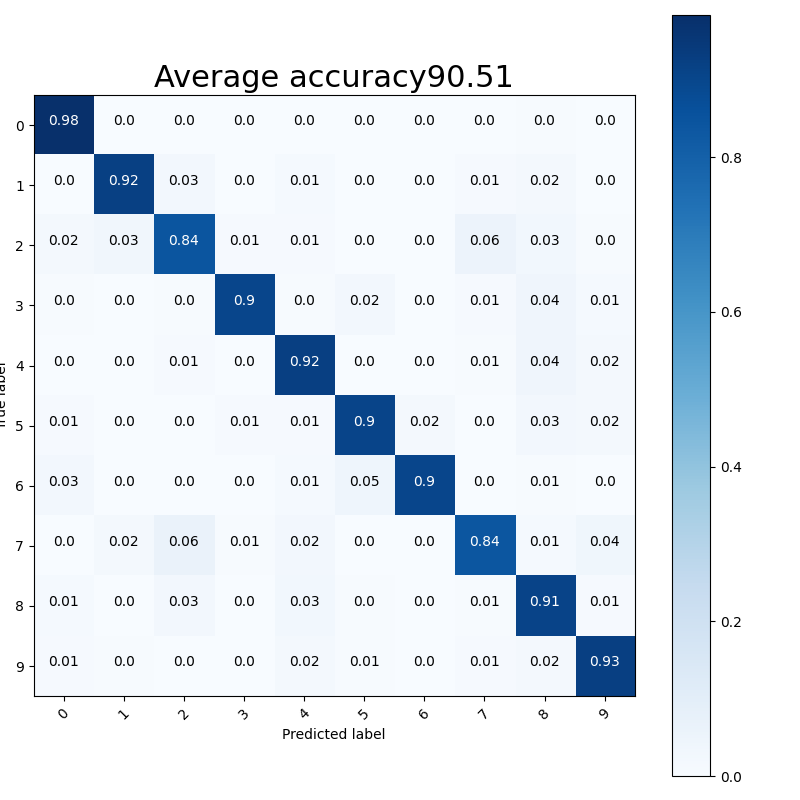
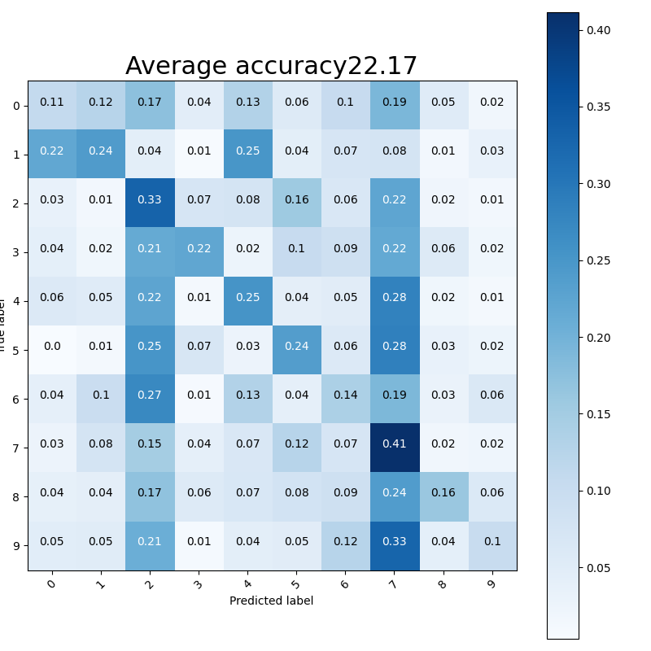
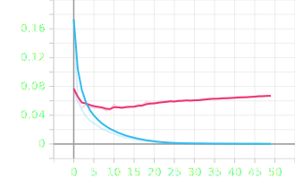

# MNIST-Experiments
Labb 3 i kursen AI-programmering

# Här är mina resultat hittils:

I den här filen ska ni beskriva:
- Era experiment
- Era slutsatser

## Uppgift 7:

### Non-Convolutional:

#### a.

Det går att öka hastigheten på lr och få inlärningshastighen snabbare, vi kom fram till att vid 0.5 lr på var där värdet istället började bli sämre igen. 

##### Run #1:

```
Settings:
    Epochs = 50
    Learning Rate = 0.01
    Validation Split = 0.2
    Batch Size = 256
    Kernel Size = (8, 8)

    accuracy = 0,9301 & 0,9309 (train först validation sen) 
    loss = 0,2475 & 0,2423 (train först validation sen)
    moved data = 11,98
    rotated data = 75,77
	
    7s
```



##### Run #2:

```
Settings:
    Epochs = 50
    Learning Rate = 1
    Validation Split = 0.2
    Batch Size = 256
    Kernel Size = (8, 8)

    accuracy = 0,9773 & 0,9478 (train först validation sen) 
    loss = 0,07375 & 0,2152 (train först validation sen)
    moved data = 15,66
    rotated data = 75,02

    försökte hitta gränsen där det  blir sämre.

    7s
```


##### Run #3:

```
Settings:
    Epochs = 50
    Learning Rate = 0.5
    Validation Split = 0.5
    Batch Size = 256
    Kernel Size = (8, 8)

    accuracy = 0,996 & 0,9662 (train först validation sen) 
    loss = 0,01788 & 0,1424 (train först validation sen)
    moved data = 16,22
    rotated data = 81,52

    At 0.5 Learning Rate, the validation model is very uneven and differs in accuracy & loss value a lot. The training model is more stable but still worse than 0.01 LR.

    7s
```


##### Run #4:

```
Settings:
    Epochs = 50
    Learning Rate = 0.4
    Validation Split = 0.2
    Batch Size = 256
    Kernel Size = (8, 8)

    accuracy = 0,9937 & 0,966 (train först validation sen) 
    loss = 0,02512 & 0,1394 (train först validation sen)
    moved data = 15,8
    rotated data = 81,69

    At 0.2 Learning Rate, the validation and training model is much more even than at the previous 0.5 LR. The accuracy stops at around 0.985 and the loss rate stops at around 0.02.

    7s
```


##### Run #5:

```
Settings:
    Epochs = 50
    Learning Rate = 0.45
    Validation Split = 0.2
    Batch Size = 256
    Kernel Size = (8, 8)

    accuracy = 0,9955 & 0,9647 (train först validation sen) 
    loss = 0,02002 & 0,1433 (train först validation sen)
    moved data = 16,3
    rotated data = 81,71

    At 0.11 LR, the training accuracy is even and stops at around 0.9946 and it's loss value at 0.02. The validation model has 		more uneven values in both accuracy and loss. It stops at around 0.985 accuracy and 0.055 loss.

    7s
```




#### b.

Genom att sänka batch sizen så får vi bättre prestanda fast med en längre inlärningstid när vi går lägre på batch sizen.

##### Run #1:

```
Settings:
    Epochs = 50
    Learning Rate = 0.1
    Validation Split = 0.2
    Batch Size = 128
    Kernel Size = (8, 8)


    accuracy = 0,9866 & 0,9681 (train först validation sen) 
    loss = 0,04838 & 0,116 (train först validation sen)
    moved data = 15,36
    rotated data = 82,68

    cut the step speed in half but did not change the total time, more steps!

    12s
```


##### Run #2:

```
Settings:
    Epochs = 50
    Learning Rate = 0.1
    Validation Split = 0.2
    Batch Size = 64
    Kernel Size = (8, 8)

    accuracy = 0,9935 & 0,9633 (train först validation sen) 
    loss = 0,02563 & 0,1467 (train först validation sen)
    moved data = 16,79
    rotated data = 81,38

    cuts the step speed down to 4ms/step

    23s

    accuracy går upp och loss ned men på förlust av både moved data och rotated data ifall vi går ner mera
```


#### c.

Det vanliga neuronnätet (non-convolutional) gick igenom varje epok mycket snabbare än CNN. 
Ett Non-convolutional neural network går igenom en bild varje pixel för sig, medan ett convolutional NN går igenom en bild med större block som innehåller sub-NNs.

#### d.

Under första körningen vinner CNN i jämförelse med ANN då efter 50 epoker hade den en bättre accuracy med mycket mindre loss. Dock tar CNN mycket längre tid att köra igenom alla 50 epoker i jämförelse med ANN.

#### e.

Lär sig lite mer, men tar väldigt mycket mer tid. Inte värt att använda då modeller med mindre neuroner kan lära sig ungefär lika mycket på mycket kortare tid.

##### Run #1:

```
Settings:
    Epochs = 50
    Learning Rate = 0.01
    Validation Split = 0.2
    Batch Size = 256
    Kernel Size = (8, 8)
    Neuroner =  64

    accuracy = 0,9855 & 0,9724 (train först validation sen) 
    loss = 0,05508 & 0,1008 (train först validation sen)
    moved data = 16,18
    rotated data = 83,17

    With four times more neurons (64) than before the model achieved 0.9911/0.9854 (train/valid) accuracy and 0.03172/0.04813 loss. It took way longer to run through all the epochs. 

    step speed 800u/s	

    8s
```


##### Run #2:

```
Settings:
    Epochs = 50
    Learning Rate = 0.1
    Validation Split = 0.2
    Batch Size = 256
    Kernel Size = (8, 8)
    Neuroner = 128

    accuracy = 0,9903 & 0,9732 (train först validation sen) 
    loss = 0,0412 & 0,08945 (train först validation sen)
    moved data = 15,62
    rotated data = 85,43

    With 128 neurons the model achieved 0.09916/0.9857 (train/valid) accuracy and 0.03089/0.04789 loss. It took almost 8 minutes 

    step speed 1 m/s

    9s
```


#### f.

Kernel Size existerar inte i ANN.


#### g.

Att lägga till lager i ANN gjorde ingen skillnad.


### Convolutional:

#### a.

##### Run #1:

```
Settings:
    Epochs = 50
    Learning Rate = 0.01
    Validation Split = 0.2
    Batch Size = 256
    Kernel Size = (8, 8)

    accuracy = 0,9736 & 0,9736 (train först validation sen) 
    loss = 0,0969 & 0,09685 (train först validation sen)
    moved data = 18,06
    rotated data = 85,99

    1m 55s
```





##### Run #2:

```
Settings:
    Epochs = 50
    Learning Rate = 1
    Validation Split = 0.2
    Batch Size = 256
    Kernel Size = (8, 8)

    accuracy = 0,1127 & 0,106 (train först validation sen) 
    loss = 2,302 & 2,302 (train först validation sen)
    moved data = 11,35
    rotated data = 7,32

    At 1.00 Learning Rate, accuracy and loss does not change and is at a stable 0.1 and 2.4 in value.
    försökte hitta gränsen där det  blir sämre.

    1m 50s
```


##### Run #3:

```
Settings:
    Epochs = 50
    Learning Rate = 0.5
    Validation Split = 0.5
    Batch Size = 256
    Kernel Size = (8, 8)

    accuracy = 0,9873 & 0,9731 (train först validation sen) 
    loss = 0,03895 & 0,1066 (train först validation sen)
    moved data = 21,51
    rotated data = 85,01

    At 0.5 Learning Rate, the validation model is very uneven and differs in accuracy & loss value a lot. The training model is more stable but still worse than 0.01 LR.

    1m 48s
```


##### Run #4:

```
Settings:
    Epochs = 50
    Learning Rate = 0.4
    Validation Split = 0.2
    Batch Size = 256
    Kernel Size = (8, 8)

    accuracy = 0,9954 & 0,9826 (train först validation sen) 
    loss = 0,01648 & 0,07377 (train först validation sen)
    moved data = 19,32
    rotated data = 86,84

    At 0.2 Learning Rate, the validation and training model is much more even than at the previous 0.5 LR. The accuracy stops at around 0.985 and the loss rate stops at around 0.02.

    1m 49s
```


##### Run #5:

```
Settings:
    Epochs = 50
    Learning Rate = 0.45
    Validation Split = 0.2
    Batch Size = 256
    Kernel Size = (8, 8)

    accuracy = 0,9993 & 0,9869 (train först validation sen) 
    loss = 3,9969 * 10^-3 & 0,05882 (train först validation sen)
    moved data = 21,2
    rotated data = 91,1

    1m 50s
```


#### b.

##### Run #1:

```
Settings:
    Epochs = 50
    Learning Rate = 0.1
    Validation Split = 0.2
    Batch Size = 128
    Kernel Size = (8, 8)


    accuracy = 0,9974 & 0,9852 (train först validation sen) 
    loss = 0,01113 & 0,05159 (train först validation sen)
    moved data = 22,04
    rotated data = 90,16

    cut the step speed in half but did not change the total time, more steps!

    1m 58s
```


##### Run #2:

```
Settings:
    Epochs = 50
    Learning Rate = 0.1
    Validation Split = 0.2
    Batch Size = 64
    Kernel Size = (8, 8)

    accuracy = 0,9993 & 0,9862 (train först validation sen) 
    loss = 4,2165 *10^-3 & 0,05742 (train först validation sen)
    moved data = 22,01
    rotated data = 89,24

    cuts the step speed down to 4ms/step

    2m 24s

    accuracy går upp och loss ned men på förlust av både moved data och rotated data ifall vi går ner mera
```


#### e.

##### Run #1:

```
Settings:
    Epochs = 50
    Learning Rate = 0.01
    Validation Split = 0.2
    Batch Size = 256
    Kernel Size = (8, 8)
    Neuroner =  64

    accuracy = 0,9952 & 0,9868 (train först validation sen) 
    loss = 0,0177 & 0,04404 (train först validation sen)
    moved data = 22,11
    rotated data = 89,21

    With four times more neurons (64) than before the model achieved 0.9911/0.9854 (train/valid) accuracy and 0.03172/0.04813 loss. It took way longer to run through all the epochs. 

    step speed 27m/s	

    4m 13s
```


##### Run #2:

```
Settings:
    Epochs = 50
    Learning Rate = 0.1
    Validation Split = 0.2
    Batch Size = 256
    Kernel Size = (8, 8)
    Neuroner = 128

    accuracy = 0,9958 & 0,9877 (train först validation sen) 
    loss = 0,01724 & 0,04193 (train först validation sen)
    moved data = 22,21
    rotated data = 89,22

    With 128 neurons the model achieved 0.09916/0.9857 (train/valid) accuracy and 0.03089/0.04789 loss. It took almost 8 minutes 

    step speed 52 m/s

    8m 4s
```


#### f.

Att öka Kernel Size över (10, 10) försämrar modellen. Att öka Strides försämrar också modellen.

##### Run #1:

```
Settings:
    Epochs = 50
    Learning Rate = 0.1
    Validation Split = 0.2
    Batch Size = 256
    Kernel Size = (10, 10)
    Strides = (2, 2)

    accuracy = 0,9904 & 0,983 (train först validation sen) 
    loss = 0,03371 & 0,0539 (train först validation sen)
    moved data = 22,17
    rotated data = 90,51

    41s
```




##### Run #2:

```
Settings:
    Epochs = 50
    Learning Rate = 0.1
    Validation Split = 0.2
    Batch Size = 256
    Kernel Size = (10, 10)
    Strides = (1, 1)

    accuracy = 0,9938 & 0,9853 (train först validation sen) 
    loss = 0,02231 & 0,04759 (train först validation sen)
    moved data = 21,07
    rotated data = 90,85

    1m 58s
```


##### Run #3:

```
Settings:
    Epochs = 50
    Learning Rate = 0.1
    Validation Split = 0.2
    Batch Size = 256
    Kernel Size = (8, 8)
    Strides = (2, 2)

    accuracy = 0,9892 & 0,9827 (train först validation sen) 
    loss = 0,03571 & 0,0574 (train först validation sen)
    moved data = 23,3
    rotated data = 87,76

    37s	
```


#### g.

Precisionen blir mycket bättre men detta i kostnad mot träningstid, som även ökar väldigt mycket.

##### Run #1:

```
Settings:
    Epochs = 50
    Learning Rate = 0.1
    Validation Split = 0.2
    Batch Size = 256
    layers = 2

    accuracy = 0,9989 & 0,9872 (Train & Validation) 
    loss = 5,7956*10^-3 & 0,05679 (Train & Validation) 
    moved data = 22,64
    rotated data = 91,66

    8min 43s
```


## Uppgift 8:

### Convolutional (CNN):

#### Experiment #1:

```
Settings:    
    Epochs =            50    
    Learning Rate =     0.3  
    Batch Size =        64  
    Kernel Size =       (8, 8)
    Strides =           (1, 1)
    Layers =            2
    Neurons =           32
    
Results (Accuracy & Loss):
    Accuracy (Train & Validation):  1 & 0.9897
    Moved:                          23.74 Average
    Rotated:                        89.92 Average
    
    Loss (Train & Validation):      2.1445*10^-5 & 0.007792
    
    Time elapsed: 21 minutes 47 seconds
    
Anledning & Slutsats: Här försökte vi balansera slutsatserna utifrån föregående experiment för att hitta den bästa modellen.
Denna modell fick okej resultat men var väldigt långsam på att träna upp sig.
```


#### Experiment #2:

```
Settings:    
    Epochs =            50    
    Learning Rate =     0.35  
    Batch Size =        64  
    Kernel Size =       (8, 8)
    Strides =           (1, 1)
    Layers =            1
    Neurons =           16
    
Results (Accuracy & Loss):
    Accuracy (Train & Validation):  0.9963 & 0.9794
    Moved:                          21.01 Average
    Rotated:                        86.47 Average
    
    Loss (Train & Validation):      0.01093 & 0.1201
    
    Time elapsed: 2 minutes 15 seconds
    
Anledning & Slutsats: Här sänkte vi antalet layers & neuroner för att försöka snabba upp modellen. Vi ökade även LR för att se om resultaten blir bättre eller likadana.
Denna modell fick mycket sämre resultat, men var även mycket snabbare än föregående.
```


#### Experiment #3:

```
Settings:    
    Epochs =            50    
    Learning Rate =     0.40  
    Batch Size =        64  
    Kernel Size =       (8, 8)
    Strides =           (1, 1)
    Layers =            1
    Neurons =           32
    
Results (Accuracy & Loss):
    Accuracy (Train & Validation):  1 & 0.9875
    Moved:                          21.65 Average
    Rotated:                        90.17 Average
    
    Loss (Train & Validation):      2.9956*10^-4 & 0.06705
    
    Time elapsed: 2 minutes 57 seconds
    
Anledning & Slutsats: Här ökade vi antalet neuroner och LR för att se om vi kunde få ännu bättre resultat under ungefär likadan tid.
Denna modell fick mycket bättre resultat, dock var den lite långsammare.
Accuracy i Moved Data stannar runt 21 men i Rotated Data ökade Accuracy väldigt mycket. Loss blev även väldigt mycket lägre.
```





#### Experiment #4:

```
Settings:    
    Epochs =            50    
    Learning Rate =     0.4  
    Batch Size =        32  
    Kernel Size =       (8, 8)
    Strides =           (1, 1)
    Layers =            1
    Neurons =           64
    
Results (Accuracy & Loss):
    Accuracy (Train & Validation):  1 & 0.9866
    Moved:                          21.27 Average
    Rotated:                        89.29 Average
    
    Loss (Train & Validation):      8.0342*10^-5 & 0.0895
    
    Time elapsed: 5 minutes 22 seconds
    
Anledning & Slutsats: Vi dubblade antalet neuroner och halverade Batch Size för att se om resultatet kan bli ännu bättre under en kortare tid.
Denna modell fick sämre resultat i både Moved och Rotated Data. Den tog även nästan dubbelt så lång tid att köra igenom.
Loss under Train var dock en tiondel lägre än föregående modell.
```


#### Experiment #5:

```
Settings:    
    Epochs =            50    
    Learning Rate =     0.35
    Batch Size =        128  
    Kernel Size =       (8, 8)
    Strides =           (1, 1)
    Layers =            1
    Neurons =           32
    
Results (Accuracy & Loss):
    Accuracy (Train & Validation):  1 & 0.9877
    Moved:                          21.86 Average
    Rotated:                        89.97 Average
    
    Loss (Train & Validation):      8.7093*10^-4 & 0.05637
    
    Time elapsed: 2 minutes 59 seconds
    
Anledning & Slutsats: Här ville vi testa några andra slumpvalda värden utifrån föregående experiment för att se hur stor skillnad dem olika värdena gör.
Denna modell hade okej resultat. Accuracy i Moved Data var högst av alla modeller, men Accuracy i Rotated Data var ungefär lika. Loss var dock hyffsat låg.
Tiden spenderad var även runt genomsnittet.
```


#### Slutsats Experiment CNN:
Modellen i Experiment #3 gav oss bäst resultat när det gäller Accuracy och tid spenderad.


### Non-Convolutional (ANN):

#### Experiment #1:

```
Settings:    
    Epochs =            50    
    Learning Rate =     0.3  
    Batch Size =        64  
    Neurons =           32  
    
Results (Accuracy & Loss):
    Accuracy (Train & Validation):  0.994 & 0.9651
    Moved:                          15.54 Average
    Rotated:                        82.28 Average
    
    Loss (Train & Validation):      0.01946 & 0.2458
    
    Time elapsed: 23 seconds
    
Anledning & Slutsats: Här ville vi testa samma värden som med Convolutional för att få en grund att utgå ifrån.
Denna modell var väldigt dålig men väldigt snabb.
```


#### Experiment #2:

```
Settings:    
    Epochs =            50    
    Learning Rate =     0.4
    Batch Size =        64 
    Neurons =           64  
    
Results (Accuracy & Loss):
    Accuracy (Train & Validation):  1 & 0.9769
    Moved:                          16.73 Average
    Rotated:                        85.98 Average
    
    Loss (Train & Validation):      6.8722*10^-4 & 0.1196
    
    Time elapsed: 24 seconds
    
Anledning & Slutsats: Här dubblade vi antalet neuroner för att se om resultatet skulle förbättras.
Alla resultat blev mycket bättre, Accuracy i allt test-data ökade och mängden Loss förbättras drastiskt.
Det tog även bara en sekund längre för modellen att träna och validera test-datat.
```


#### Experiment #3:

```
Settings:    
    Epochs =            50    
    Learning Rate =     0.4
    Batch Size =        64 
    Neurons =           128
    
Results (Accuracy & Loss):
    Accuracy (Train & Validation):  1 & 0.9789
    Moved:                          17.39 Average
    Rotated:                        87.68 Average
    
    Loss (Train & Validation):      5.4733*10^-4 & 0.09306
    
    Time elapsed: 25 seconds
    
Anledning & Slutsats: Återigen gick vi på spåret att dubbla antalet neuroner.
Resultatet blev återigen bättre.
Tiden spenderad var bara en sekund längre.
```


#### Experiment #4:

```
Settings:    
    Epochs =            50    
    Learning Rate =     0.4
    Batch Size =        64 
    Neurons =           1024
    
Results (Accuracy & Loss):
    Accuracy (Train & Validation):  1 & 0.9827
    Moved:                          17.51 Average
    Rotated:                        88.36 Average
    
    Loss (Train & Validation):      4.2237*10^-4 & 0.07589
    
    Time elapsed: 1 minute 19 seconds
    
Anledning & Slutsats: Här multiplicerade vi antalet neuroner med åtta för att se när modellen blir sämre.
Resultatet blev knappast bättre.
Tiden spenderad var nästan en hel minut längre.
```


#### Experiment #5:

```
Settings:    
    Epochs =            50    
    Learning Rate =     0.4
    Batch Size =        64 
    Neurons =           16384
    
Results (Accuracy & Loss):
    Accuracy (Train & Validation):  1 & 0.9842
    Moved:                          17.39 Average
    Rotated:                        88.42 Average
    
    Loss (Train & Validation):      4.05*10^-4 & 0.07187
    
    Time elapsed: 13 minutes 17 seconds
    
Anledning & Slutsats: Här multiplicerade vi antalet neuroner med 16 för att återigen se när modellen blir sämre.
Resultatet var väldigt varierat. Moved Data fick sämre Accuracy, medan Rotated Data fick lite bättre.
Tiden spenderad var nästan 15 minuter. Alldeles för långsamt för ett sådant mediokert resultat.
```


#### Experiment #6:

```
Settings:    
    Epochs =            50    
    Learning Rate =     0.4
    Batch Size =        32
    Neurons =           1024
    
Results (Accuracy & Loss):
    Accuracy (Train & Validation):  1 & 0.9836
    Moved:                          17.69 Average
    Rotated:                        89.04 Average
    
    Loss (Train & Validation):      1.5577*10^-4 & 0.08045
    
    Time elapsed: 2 minutes 36 seconds
    
Anledning & Slutsats: Vi gick tillbaka till 1024 neuroner och testade istället att halvera Batch Size.
Detta gav oss högst Accuracy i både Moved & Rotated Data, samt låg Loss. Alltså ett godkänt resultat på genomsnittligt kort tid.
```


#### Slutsats Experiment ANN:
Modellen i Experiment #6 gav oss bäst resultat när det gäller Accuracy och tid spenderad.